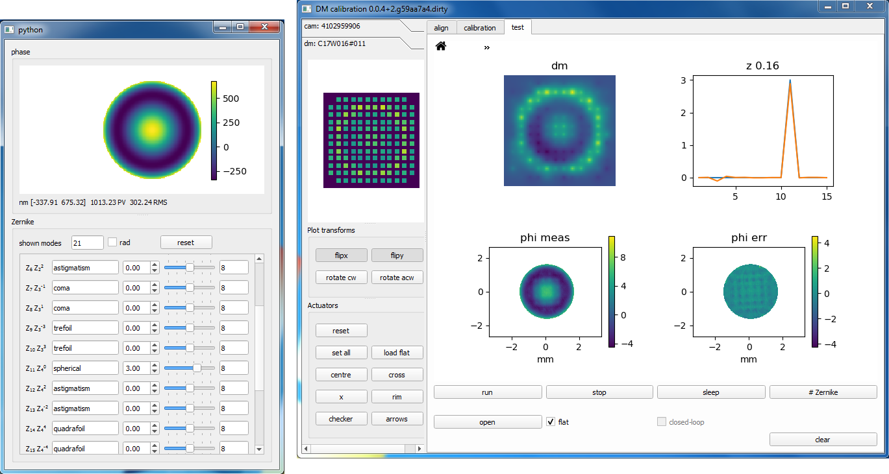

# dmlib

[](https://doi.org/10.5281/zenodo.3714951)

Python library for calibration and control of deformable mirrors (DM). This
library implements the methods described in detail in this
[tutorial](https://doi.org/10.5281/zenodo.3714951) from
[aomicroscopy.org](https://aomicroscopy.org).



`dmlib` is meant to be used as an external library in a Python application that
needs to control DMs. `dmlib` is not bound to particular hardware, and can be
used with any kind of DM. To control actual hardware you can either use your
own manufacturer-provided library or one of the existing wrappers found in the
subpackage [devwraps](https://github.com/sakoho81/devwraps).

There are two possible use cases:

- Full calibration and control using `dmlib`. You can use `dmlib`'s GUIs and
  embed them into your Python application. In this case your DM and scientific
  camera must be directly supported via the hardware wrappers subpackage
  [devwraps](https://github.com/sakoho81/devwraps). A guide explaining
  how to use the GUIs is found
  [here](https://github.com/sakoho81/dmlib/tree/master/doc).
- Calibration with `dmlib` and control using your *own code*. If your DM is
  directly supported by `dmlib`, then you can use `dmlib`'s calibration GUI to
  collect the calibration data and to generate a calibration file. Subsequently
  you can load the control matrix from the calibration file and use it in your
  own code.  Instead, if your hardware is not directly supported by `dmlib`,
  you can adjust the data collection script `data_collection.py` in the
  `examples` folder and collect the calibration data with this script.
  Afterwards, you can generate the calibration as shown in the
  `examples/calibration.py` script.

## Installation

Hardware devices such as DMs and scientific cameras are only supported in
Windows via the [devwraps](https://github.com/sakoho81/devwraps)
subpackage (see its own repository for installation instructions). You can
still install `dmlib` under Linux and run the GUIs, but only in simulation
mode (using dummy virtual devices).

`dmlib` is installed like any regular Python package. With
[uv](https://docs.astral.sh/uv/):

```bash
git clone https://github.com/sakoho81/dmlib
cd dmlib
uv sync --extra gui --extra plot
```

or with `pip`:

```bash
pip install .[gui,plot]
```

The `gui` and `plot` extras are required to run `dmlib`'s GUIs
(`dmlib.calibrate`/`dmlib.control`); without them only the calibration/control
library code is installed.

## Running dmlib GUIs

### DM calibration GUI (dmlib.gui)

The calibration GUI `dmlib.gui` can be used to interferometrically calibrate
and test a DM. You can start the GUI using a BAT script as outlined in the
[guide](https://github.com/sakoho81/dmlib/tree/master/doc).
Alternatively, open a terminal and query the available drivers with
`python -m dmlib.gui --help`. Select the appropriate drivers flags and run the
GUI again without the `--help` flag.

For example

```bash
python -m dmlib.gui --dm-driver bmc --dm-name DM_SERIAL_NUMBER --cam-driver
thorcam --cam-name CAM_SERIAL_NUMBER
```

would run `dmlib.gui` using the Boston Multi-DM with serial number
`DM_SERIAL_NUMBER` and the Thorlabs camera with serial number
`CAM_SERIAL_NUMBER`.

To run the calibration GUI in simulation mode without any hardware, use
```bash
python -m dmlib.gui --dm-driver sim --cam-driver sim
```

For convenience, you can create a `BAT` file with the correct parameters by
modifying the `examples/run_calibration_gui.bat`.

### DM control using Zernike modes (dmlib.zpanel)

The control GUI `dmlib.zpanel` can load a DM calibration file and control the
DM in open-loop using Zernike modes. You can start the GUI using a BAT script
as outlined in the
[guide](https://github.com/sakoho81/dmlib/tree/master/doc).
Alternatively, open a terminal and use the `-m dmlib.zpanel` flag to
start this GUI. You can query the GUIs flags with `--help` as seen above.

## References

<a id="1">[1]</a> J. Antonello, J. Wang, C. He, M. Phillips, and M. Booth, "Interferometric calibration of a deformable mirror," [10.5281/zenodo.3714951](https://doi.org/10.5281/zenodo.3714951).
